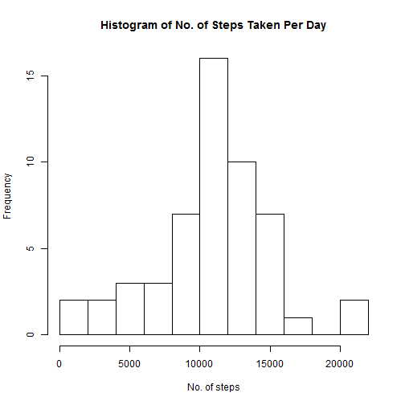
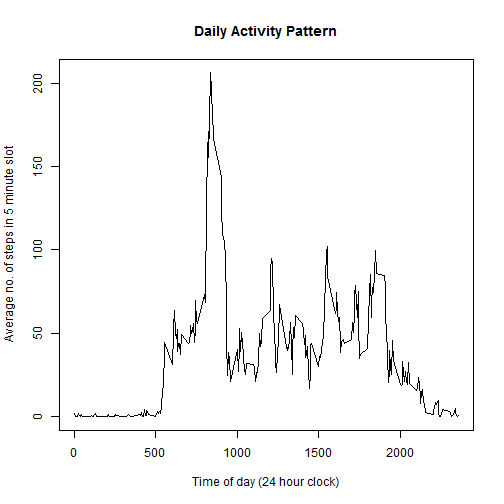
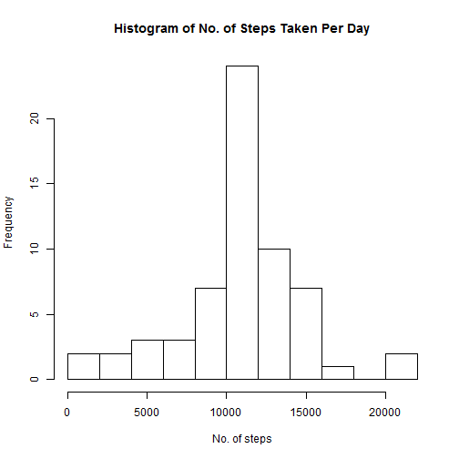
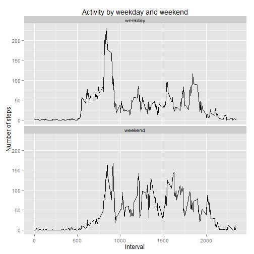

# Reproducible Research: Peer Assessment 1

This is the deliverable for Assignment 1 of the Reproducible Research class. 

A global setting is made to show the code in the output deliverable.


```r
opts_chunk$set(echo=TRUE)

library(plyr)
```

## Loading and preprocessing the data

First, load the data with the columns in the appropriate formats


```r
data <- read.csv("activity.csv", 
                 colClasses = c("numeric", "Date", "numeric"))
```


## What is mean total number of steps taken per day?

For this section, missing values in the dataset are ignored.

Below is a histogram of the total number of steps taken each day.


```r
e <- aggregate(data$steps, by=list(Date=data$date), FUN=sum)
hist(e$x, 
     breaks=15, 
     main="Histogram of No. of Steps Taken Per Day",
     xlab="No. of steps", 
     ylab="Frequency")
```

 


```r
medianS <- median(e$x, na.rm=TRUE)
meanS <- mean(e$x, na.rm=TRUE)
```

The **mean** number of steps taken per day = 1.0766 &times; 10<sup>4</sup>  
The **median** number of steps taken per day = 1.0765 &times; 10<sup>4</sup>


## What is the average daily activity pattern?


```r
g <- aggregate(data$steps, 
               by=list(interval=data$interval), 
               FUN=mean, 
               na.rm=TRUE)
plot(g$interval, 
     g$x, 
     type="l", 
     main="Daily Activity Pattern",
     xlab="Time of day (24 hour clock)",
     ylab="Average no. of steps in 5 minute slot")
```

 


```r
maxSlot <- subset(g, g$x==max(g$x, na.rm=TRUE))$interval
```

The 5-minute slot with the highest average number of steps is 835 (24-hour clock).


## Imputing missing values

The NAs in the steps column as seen in the original dataset will be replaced with the 
average for the intervals concerned.


```r
comb <- merge(data, g, by="interval")
comb$steps <- ifelse(is.na(comb$steps), comb$x, comb$steps)
```

Then the histogram will be plotted for this updated set of data.
Exploratory analysis suggests that the NAs in the original set appeared across 8
full days. Therefore, replacing these NAs with the average for the intervals 
should have the effect of simply increasing the frequency of the most common 
block of the histogram by 8.


```r
combH <- aggregate(comb$steps, by=list(Date=comb$date), FUN=sum)
hist(combH$x, 
     breaks=15,
     main="Histogram of No. of Steps Taken Per Day",
     xlab="No. of steps", 
     ylab="Frequency")
```

 

Similarly, recalculating the mean, should yield the same result as before.
And the median should be seen to get closer to the mean.


```r
medianN <- median(combH$x, na.rm=TRUE)
meanN <- mean(combH$x, na.rm=TRUE)
```

The **mean** number of steps taken per day = 1.0766 &times; 10<sup>4</sup>  
The **median** number of steps taken per day = 1.0766 &times; 10<sup>4</sup>


## Are there differences in activity patterns between weekdays and weekends?


```r
library(ggplot2)

dayType <- data.frame(day=c("Monday","Tuesday","Wednesday","Thursday",
                            "Friday","Saturday","Sunday"), 
                      type=c("weekday","weekday","weekday","weekday",
                             "weekday","weekend","weekend"))
comb$day <- weekdays(comb$date)
comb <- join(comb,dayType,by='day')
comb <- comb[order(comb$date),]

p <- aggregate(comb$steps, 
               by=list(type=comb$type, interval=data$interval), 
               FUN=mean, 
               na.rm=TRUE)

a <- ggplot(data=p, aes(x=interval, y=x))
a <- a + geom_line()
a <- a + facet_wrap(~type, ncol=1)
a <- a + xlab("Interval") + ylab("Number of steps") + ggtitle("Activity by weekday and weekend")
a
```

 

There are clear differences between weekday and weekend activity for this set of data.  
For example, at the weekend, there is reduced activity in the period around 06:00 and a lower morning peak - as compared to weekday activity.
